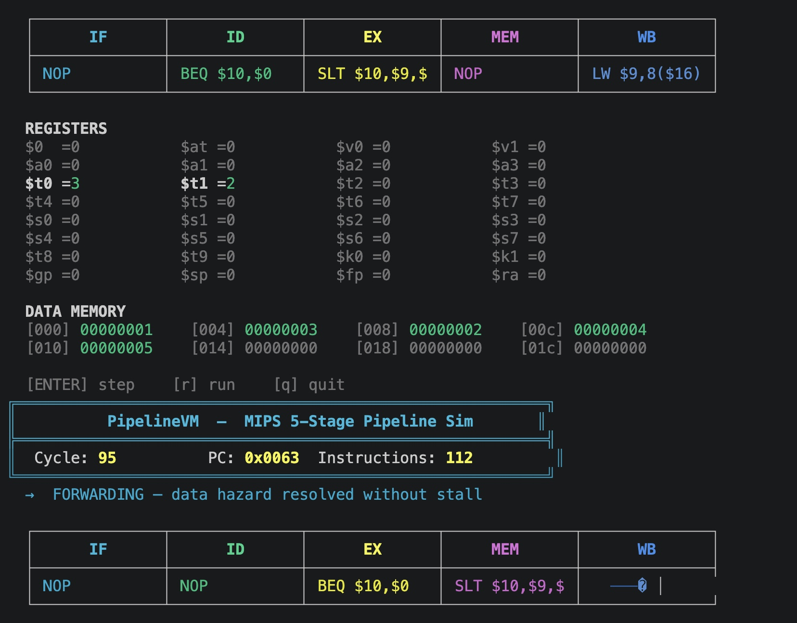
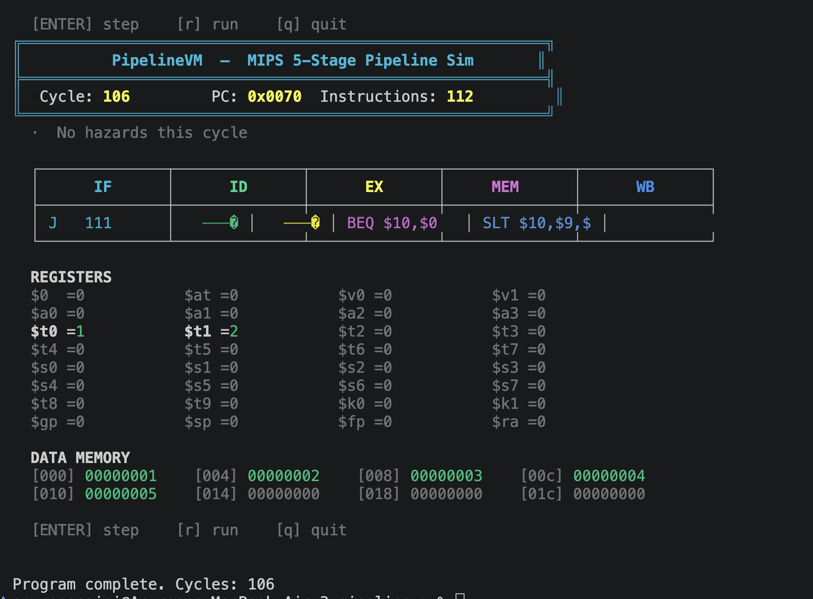

# PipelineVM
**A MIPS-Inspired 5-Stage Pipelined Virtual Machine in C**

Built for HackPSU Spring 2026. Simulates a real CPU pipeline with hazard detection, data forwarding, and a live terminal visualizer.

---

## What It Does
You write assembly, the included assembler compiles it to bytecode, and the VM executes it — showing in real time which instruction is in IF, ID, EX, MEM, and WB at every clock cycle. Hazards and forwards are detected and displayed automatically.

## Demo




## Connection to Systems Programming
- Written entirely in **C** with no external libraries
- Implements a **custom ISA**, **two-pass assembler**, and **binary bytecode format**
- Simulates **load-use stall detection** and **EX/MEM → EX forwarding**
- Models a **4KB byte-addressable data memory** with big-endian word layout
- Direct application of CMPEN 331 pipeline concepts (IF, ID, EX, MEM, WB)

---

## Build & Run
```bash
make clean all

# Assemble + run bubble sort
bin/assembler programs/sort.asm programs/sort.pvm
bin/pipelinevm programs/sort.pvm

# Assemble + run Fibonacci (result: $t0 = 55)
bin/assembler programs/fib.asm programs/fib.pvm
bin/pipelinevm programs/fib.pvm
```

Press `ENTER` to step cycle by cycle, `R` to run, `Q` to quit.

---

## Architecture
```
[ .asm file ]
      │
      ▼
┌──────────┐
│ Assembler│  (assembler.c) — two-pass, label resolution, big-endian binary
└──────────┘
      │  .pvm bytecode
      ▼
┌─────────────────────────────────┐
│           PipelineVM            │
│  ┌──────────────────────────┐   │
│  │  IF → ID → EX → MEM → WB│   │
│  └──────────────────────────┘   │
│  ┌───────────┐  ┌────────────┐  │
│  │  Register │  │   4KB Data │  │
│  │  File     │  │   Memory   │  │
│  │ (32 regs) │  │  (byte arr)│  │
│  └───────────┘  └────────────┘  │
└─────────────────────────────────┘
      │
      ▼
[ ANSI Terminal Visualizer ]  (viz.c)
```

---

## Supported ISA

**R-type:** `ADD`, `SUB`, `AND`, `OR`, `SLT`, `SLL`, `JR`

**I-type:** `ADDI`, `LW`, `SW`, `BEQ`, `BNE`

**J-type:** `J`, `JAL`

---

## Demo Programs

| Program | Description | Result |
|---|---|---|
| `fib.asm` | Computes Fibonacci(10) | `$t0 = 55` in 67 cycles |
| `sort.asm` | Bubble sorts `[5,3,1,4,2]` | `dmem = [1,2,3,4,5]` in 106 cycles |
| `hello.asm` | Countdown loop | `$t0 = 0` |

---

## Pipeline Features
- **Load-use hazard detection** → 1-cycle stall bubble inserted
- **EX/MEM → EX forwarding** → eliminates stalls where possible
- **MEM/WB → EX forwarding**
- **Branch resolution in EX** → 2-stage flush on taken branch
- **Jump resolution in ID** → 1-stage flush

---

## File Structure
```
pipelinevm/
├── src/
│   ├── assembler.c   # Two-pass assembler, binary encoder
│   ├── vm.c          # Pipeline clock cycle, hazard/forward logic
│   ├── pipeline.c    # Pipeline struct initialization
│   ├── memory.c      # Register file, byte-addressed data memory
│   ├── viz.c         # ANSI terminal visualizer
│   └── main.c
├── programs/         # .asm demo programs
├── include/          # isa.h, pipeline.h, vm.h, viz.h
└── Makefile
```

---

## License
MIT